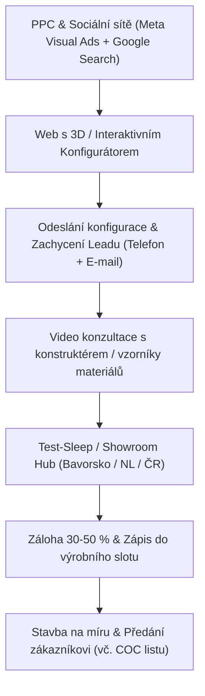

# Analýza trhu: Zakázková výroba obytných přívěsů v Evropě

Datum: Září 2026  
Zaměření: Obytné přívěsy na zakázku (bespoke / teardrop / off-road / custom camper trailers)

---

## 1. Nejlepší lokality v Evropě (Data ECF / CIVD & Nákupní síla)

Celkový trh obytných vozidel v Evropě představuje cca 221 000 nových registrací ročně, z čehož **obytné přívěsy (caravans) tvoří ~60 800+ jednotek ročně**. U zakázkové výroby (vysoká marže, cena €20 000 – €65 000+) nerozhoduje jen objem, ale **ochota platit za individualizaci a outdoor/off-grid soběstačnost**.

### Pořadí prioritních trhů:

| Pořadí | Trh / Země | Roční registrace přívěsů | Charakteristika a nákupní chování | Doporučení pro zakázkovou výrobu |
| :--- | :--- | :--- | :--- | :--- |
| **1.** | **Německo (DE)** | 21 674 ks | Největší trh v Evropě. Obrovská komunita pro outdoor, overlanding a individuální cestování. Silná poptávka po německé/evropské kvalitě zpracování a certifikaci TÜV. | **Priorita č. 1.** Klíčový region: Bavorsko, Bádensko-Württembersko, NRW. |
| **2.** | **Nizozemsko (NL)** | 7 192 ks (+6,1 % růst) | Nejvyšší hustota přívěsů na obyvatele v Evropě (>450 000 aktivních přívěsů). Obrovská kultura kempování. Velký přechod na EV vyžaduje lehké a aerodynamické přívěsy. | **Priorita č. 2.** Důraz na hmotnost (<750 kg / do 1200 kg) a kompaktnost. |
| **3.** | **Švýcarsko (CH) & Rakousko (AT)** | ~2 800 ks (CH+AT) | Extrémní kupní síla, alpské prostředí. Zákazníci vyžadují 4sezónní izolaci, topení (Truma/Webasto), soběstačnost (LiFePO4, soláry) a off-road podvozek. | **Nejvyšší marže.** Ceny €40k–€70k zde nejsou překážkou. |
| **4.** | **Skandinávie (Švédsko SE, Norsko NO)** | ~3 500 ks | Norsko: extrémní penetrace elektromobilů, vysoká kupní síla, právo volného kempování (*Allemansrätten*). Švédsko: tradiční bašta kempování. | Prémiový segment pro off-grid a zimní provoz. |
| **5.** | **Velká Británie (UK)** | ~11 400 ks | 2. největší trh objemově, ale **komplikace:** Brexit, clo/DPH na hranicích, IVA homologace, levostranný provoz (preferovány dveře na levé straně). | Fáze 2 (pouze přes lokálního britského dealera/distributora). |
| **6.** | **Francie (FR)** | ~7 380 ks | Velký trh, ale orientovaný více na konvenční značky a motorhomy; zakázkové přívěsy fungují v komunitách vanlife a outdoor. | Sekundární trh. |

---

## 2. Nejlepší Marketplaces a Prodejní Portály v Evropě

U zakázkové výroby slouží inzerce jako **lead-generation kanál** (inzeruje se modelová konfigurace s výzvou k individuální stavbě).

### A. Specializované automobilové & karavanové portály:
1. **Mobile.de (Německo / celá EU)**
   - Jednoznačná jednička v kontinentální Evropě.
   - Sekce *Wohnwagen* umožňuje filtrovat dle hmotnosti, náprav, vybavení.
   - Model: Firemní účet (Händlerkonto). Inzerovat 2–3 vzorové konfigurace (např. *Offroad Adventure Edition*, *Minimalist Teardrop*, *Full Off-Grid Solar*).
2. **AutoScout24 (DE, AT, NL, BE, IT, FR, ES)**
   - Druhý největší celoevropský dosah, silný v Beneluxu a Itálii.
3. **Marktplaats.nl (Nizozemsko)**
   - V Nizozemsku naprostý monopol na nákup a prodej karavanů. Kdo není na Marktplaats, v NL neexistuje.
4. **Kleinanzeigen.de (Německo)**
   - Dříve eBay Kleinanzeigen. Extrémní organická návštěvnost v DE pro alternativní, zakázkové, teardrop a micro-campery.
5. **Caravan24.ch / Caravan24.de (DACH)**
   - Vertikální prémiový portál pro Švýcarsko a Německo.
6. **Finn.no (Norsko) & Blocket.se (Švédsko)**
   - Monopolní národní portály pro Skandinávii.

---

## 3. Efektivní prodejní model pro zakázkovou výrobu (Funnel & Konverze)

Prodej přívěsu za €25 000 – €50 000 neprobíhá jako standardní e-commerce. Vyžaduje budování důvěry a fyzické/vizuální ověření.

### Osvědčené taktiky s nejvyšší efektivitou:
1. **Interaktivní konfigurátor s okamžitým odhadem ceny:**
   - Zákazník si nakliká podvozek, baterii, soláry, barvu, kuchyň. Získání PDF specifikace podmíněno zadáním e-mailu a telefonu.
2. **Model „Try Before You Buy“ (Půjčovna jako prodejní kanál):**
   - Umístit 1–2 předváděcí přívěsy na platformy sdílení karavanů (**Yescapa**, **PaulCamper**, **Goboony**) v klíčových lokalitách (Mnichov, Frankfurt, Utrecht).
   - Nabídka: *"Vyzkoušejte na víkend za €250. Pokud objednáte stavbu na zakázku, půjčovné vám odečteme z ceny."*
3. **Klíčové veletrhy (Zajišťují 40–60 % celoročních objednávek):**
   - **Caravan Salon Düsseldorf (DE)** – největší na světě (srpen/září).
   - **CMT Stuttgart (DE)** – největší spotřebitelský veletrh cestování a kempování (leden).
   - **Abenteuer & Allrad, Bad Kissingen (DE)** – světová špička pro off-road, 4x4 a expediční přívěsy.
   - **Kampeer & Caravan Jaarbeurs, Utrecht (NL)** – hlavní akce v Nizozemsku (říjen).

---

## 4. PPC Benchmarky, Ceny za Proklik (CPC) a Reklamní Strategie

### A. Google Search Ads (Ceny za klik dle regionu)

| Trh | Generické dotazy (*"Wohnwagen kaufen"*, *"caravan kopen"*) | Nika & Zakázka (*"Offroad Wohnwagen"*, *"Mini Wohnwagen"*, *"Teardrop Trailer"*, *"Wohnwagen nach Maß"*) | Konkurenční značky (Mink, Hero Camper, Caretta) |
| :--- | :--- | :--- | :--- |
| **Německo (DE)** | €0,90 – €2,20 | **€0,45 – €1,25** | €0,80 – €1,60 |
| **Rakousko (AT)** | €0,80 – €1,90 | **€0,40 – €1,10** | €0,75 – €1,40 |
| **Švýcarsko (CH)**| €1,50 – €3,80 | **€0,90 – €2,10** | €1,40 – €2,80 |
| **Nizozemsko (NL)**| €0,70 – €1,80 | **€0,38 – €0,95** | €0,65 – €1,30 |
| **Skandinávie (NO/SE)**| €0,85 – €2,10 | **€0,50 – €1,30** | €0,80 – €1,50 |
| **Francie (FR)** | €0,60 – €1,60 | **€0,35 – €0,90** | €0,55 – €1,20 |

> **Strategie pro Google Ads:** Vyhnout se obecnému *"Wohnwagen kaufen"* (příliš drahé, soutěží se s masovými výrobci Hobby, Knaus, Dethleffs). Cílit výhradně **Long-Tail** + **Exact Match**:
> - DE: `[offroad wohnwagen kaufen]`, `[mini wohnwagen kaufen]`, `[teardrop anhänger hersteller]`, `[wohnwagen individualausbau]`, `[expeditionsanhänger kaufen]`
> - NL: `[mini caravan kopen]`, `[offroad caravan]`, `[kleine caravan op maat]`, `[teardrop trailer nederland]`

### B. Meta Ads (Facebook & Instagram) – Nejvyšší ROI kanál
Vzhledem k tomu, že zakázkové obytné přívěsy jsou silně **vizuální a emoční produkt** (svoboda, kempování v přírodě, design interiéru ve dřevě, off-grid technologie), Meta Ads přinášejí nejnižší CPL (Cost Per Lead):

- **Průměrné CPM (cena za 1 000 zobrazení):**
  - Německo / Rakousko: €12,00 – €22,00
  - Švýcarsko: €24,00 – €38,00
  - Nizozemsko: €10,00 – €17,00
- **Průměrná cena prokliku (CPC link):** €0,35 – €0,85
- **Cena za kvalifikovaný Lead (CPL - formulář s rozpočtem a telefonem):** **€18,00 – €42,00**
- **Doporučený formát:**
  - Instagram Reels / Video: Proces ruční výroby, CNC frézování, testování v terénu, noční svícení a útulnost interiéru.
  - Carousel: Exteriér v terénu -> Rozložená kuchyňka -> Spaní -> Solární panel a elektrovýzbroj.

---

## 5. Právní a technické podmínky prodeje v EU

Pro legální prodej v DE, NL, CH a dalších zemích je **naprosto nezbytné**:
1. **Evropská homologace COC (European Whole Vehicle Type Approval - WVTA):**
   - Bez certifikátu COC zákazník v Německu (TÜV), Nizozemsku (RDW) ani Švýcarsku přívěs nezaregistruje bez drahého individuálního schvalování.
2. **Hmotnostní kategorie:**
   - **Kategorie O1 (do 750 kg):** Enormní výhoda na trhu (stačí ŘP skupiny B, žádné povinné technické prohlídky v některých zemích, utáhnou i menší elektromobily / hybridy).
   - **Kategorie O2 (750 – 3 500 kg):** Nutná nájezdová brzda, homologovaná náprava a spojovací zařízení (AL-KO, Knott).
3. **Plyn a elektroinstalace (CE & G 607):**
   - Certifikace plynové soustavy (v Německu vyžadována revize podle DVGW G 607). Pro usnadnění prodeje je trendem přechod na **All-Electric / No-Gas** (indukce, dieselové topení, LiFePO4 baterie).
